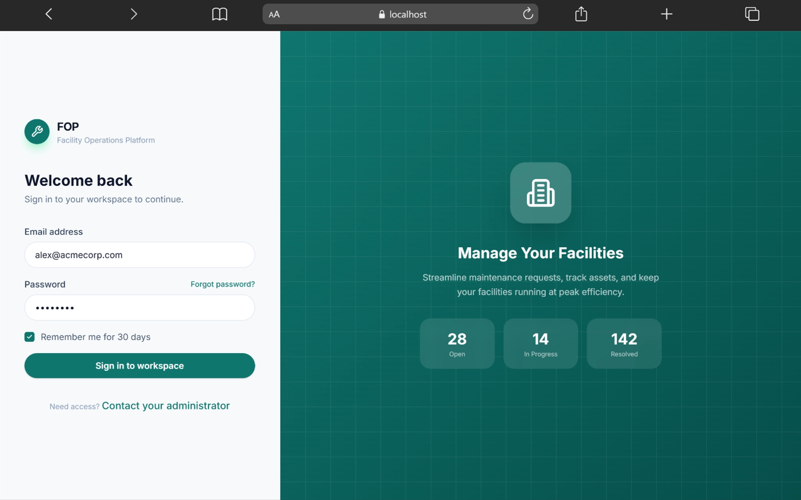
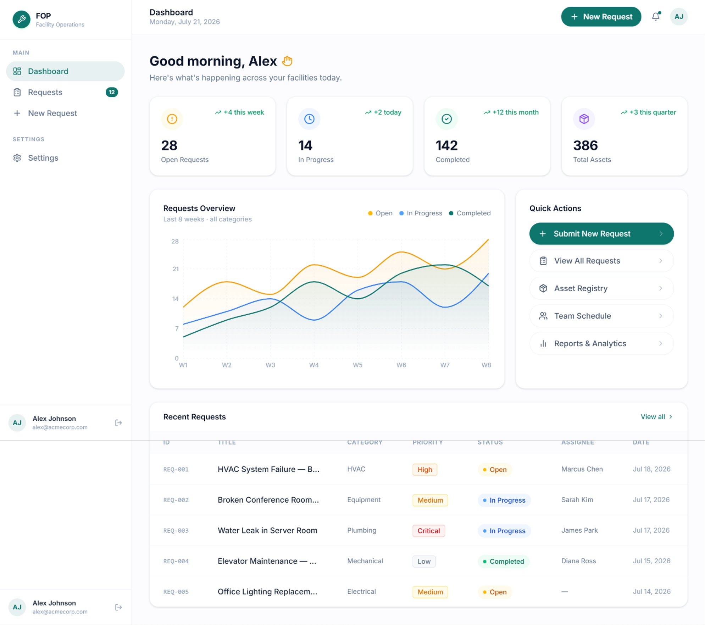
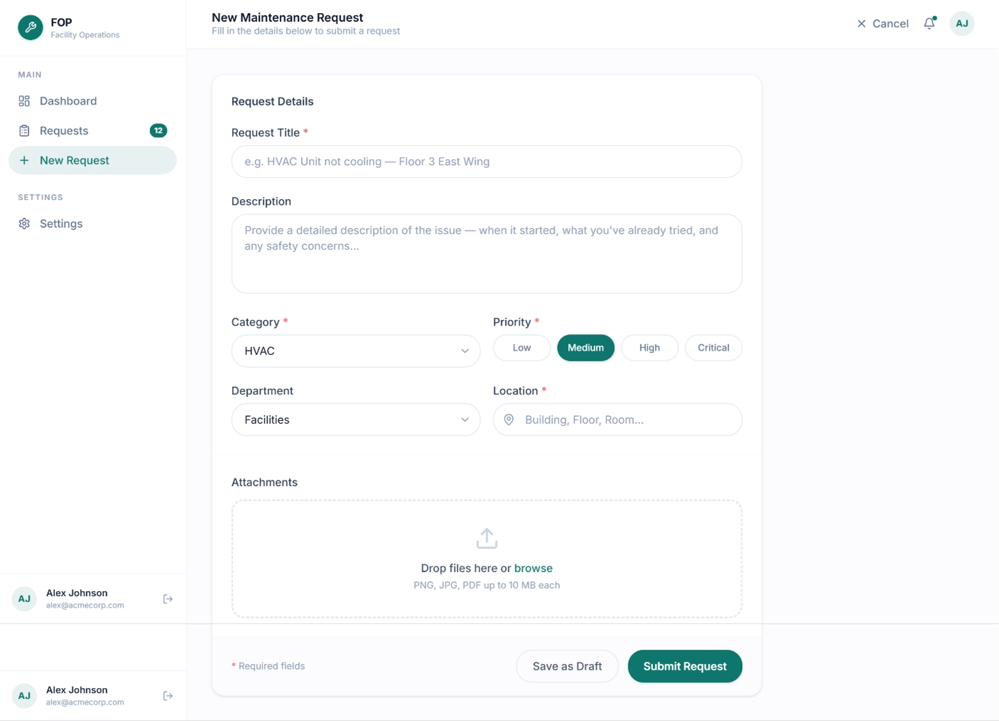

# Facility Operations Platform Prototype

A polished React prototype for managing facility maintenance operations, service requests, technicians, and operational performance from a single responsive dashboard.

This project was generated from a Figma design and implemented as a Vite-powered frontend prototype. It uses mock data inside the React screens, so it is ideal for UI review, stakeholder demos, design handoff, and early product validation.

Original Figma design:
https://www.figma.com/design/V7SLnf1oOXPT4UqjQz5Mz7/Facility-Operations-Platform-Prototype

## Screenshots

| Login | Dashboard |
| --- | --- |
|  |  |

| New Request | Request Details |
| --- | --- |
|  |  |

## Overview

Facility Operations Platform Prototype, also shown in the UI as **FOP**, is a frontend prototype for teams that receive, triage, assign, and resolve facility maintenance requests.

The app currently demonstrates the core workflow:

1. Sign in to the workspace.
2. Review facility KPIs and recent activity on the dashboard.
3. Search and filter maintenance requests.
4. Create a new maintenance request.
5. Review request details, activity history, technician assignment, and comments.

## Key Features

- Responsive login experience with remembered email/password demo state.
- Facility dashboard with KPI cards for open, in-progress, completed requests, and total assets.
- Requests overview chart powered by Recharts.
- Quick actions for submitting new requests and viewing the request list.
- Maintenance request table with search, status filters, row selection UI, pagination UI, and priority/status badges.
- New request form with category, priority, department, location, description, and attachment drop zone UI.
- Request details page with summary, metadata, assigned technician details, activity timeline, comments, and action buttons.
- Responsive layout with a desktop sidebar and mobile drawer navigation.
- Reusable UI primitives and badge/card components following a shadcn/Radix-style component structure.

## Tech Stack

| Area | Technology |
| --- | --- |
| Framework | React 18 |
| Build tool | Vite 6 |
| Language | TypeScript |
| Styling | Tailwind CSS 4, custom CSS theme files |
| UI primitives | Radix UI components |
| Icons | Lucide React, MUI Icons |
| Charts | Recharts |
| Forms/UI helpers | React Hook Form, class-variance-authority, clsx, tailwind-merge |
| Motion/interaction utilities | motion, Vaul, Sonner, Embla Carousel |

## Project Structure

```text
.
+-- screenshots/                 # Product screenshots used in this README
+-- src/
|   +-- app/
|   |   +-- App.tsx              # App shell and screen-level navigation state
|   |   +-- components/
|   |   |   +-- common/          # KPI, status, and priority display components
|   |   |   +-- layout/          # Sidebar and top bar
|   |   |   +-- ui/              # Reusable shadcn/Radix-style UI primitives
|   |   +-- screens/             # Login, dashboard, requests, create, and detail screens
|   +-- styles/                  # Fonts, Tailwind entry, globals, and theme CSS
|   +-- main.tsx                 # React entry point
+-- default_shadcn_theme.css     # Default theme reference
+-- index.html                   # Vite HTML entry
+-- package.json                 # Scripts and dependencies
+-- postcss.config.mjs
+-- vite.config.ts               # Vite, React, Tailwind, and Figma asset resolver config
+-- README.md
```

## Getting Started

### Prerequisites

- Node.js 18 or newer
- npm

This repository includes a `package-lock.json`, so npm is the recommended package manager for reproducible installs.

### Clone the repository

```bash
git clone https://github.com/roaaahmedmohamed/FOP-Platform.git
```

### Installation

```bash
npm install
```

### Run Locally

```bash
npm run dev
```

Vite will print a local development URL in the terminal, typically:

```text
http://localhost:5173/
```

Open that URL in your browser to view the prototype.

### Build for Production

```bash
npm run build
```

The compiled output is generated in the `dist/` directory.

## Available Scripts

| Command | Description |
| --- | --- |
| `npm run dev` | Starts the Vite development server. |
| `npm run build` | Creates a production build in `dist/`. |

## Environment Variables

No environment variables are required for the current prototype.

## Testing

No automated test script is currently defined in `package.json`.

For now, validate changes manually by running the development server and checking:

- Login flow navigates to the dashboard.
- Sidebar navigation works on desktop.
- Mobile menu opens and closes correctly.
- Request search and status filters update the table.
- New request form controls respond to user interaction.
- Request detail page renders timeline, comments, metadata, and action buttons.

## Implementation Notes

- The app uses local React state for navigation instead of route-based navigation.
- Request records, chart values, timelines, and comments are hardcoded mock data in the screen components.
- The login form is a demo UI; it does not authenticate against an API.
- Some quick action buttons are presentational placeholders and do not yet navigate to implemented screens.
- `vite.config.ts` includes a `figma:asset/` resolver for Figma-generated asset imports.

## Troubleshooting

| Issue | Suggested Fix |
| --- | --- |
| Dependencies fail to install | Confirm Node.js is installed, then rerun `npm install`. |
| Dev server port is already in use | Vite will usually suggest another port; open the URL shown in the terminal. |
| Styles do not appear correctly | Make sure `src/styles/index.css` is imported by `src/main.tsx` and restart the dev server. |
| Screenshot image is missing in README | Confirm the image exists in `screenshots/` and that the filename has not changed. |

## Roadmap Ideas

- Add real route handling with React Router.
- Connect requests to an API or backend service.
- Add authentication and role-based access.
- Persist created requests.
- Add automated tests for key UI flows.
- Add linting, formatting, and CI checks.


